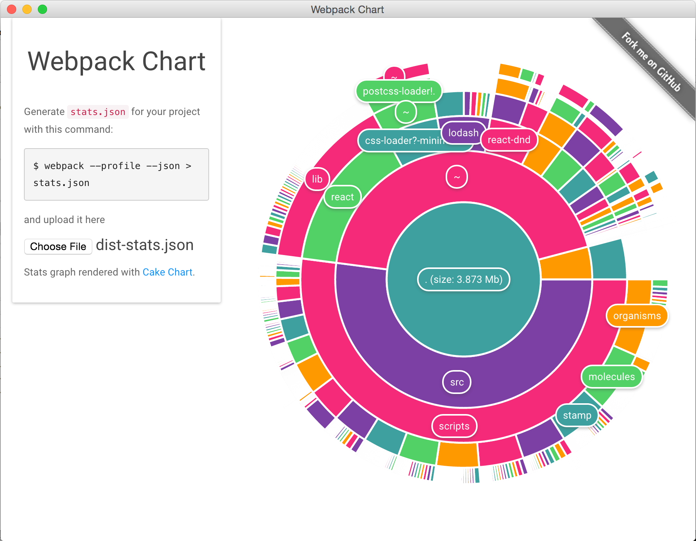

# webpack-chart

Interactive pie chart for Webpack stats. [Try it out](https://alexkuz.github.io/webpack-chart/).

And now there is a desktop version (created with [Electron](https://github.com/atom/electron)). Download it [here](https://github.com/alexkuz/webpack-chart/releases).

Uses [Cake Chart](https://github.com/alexkuz/cake-chart) component.
